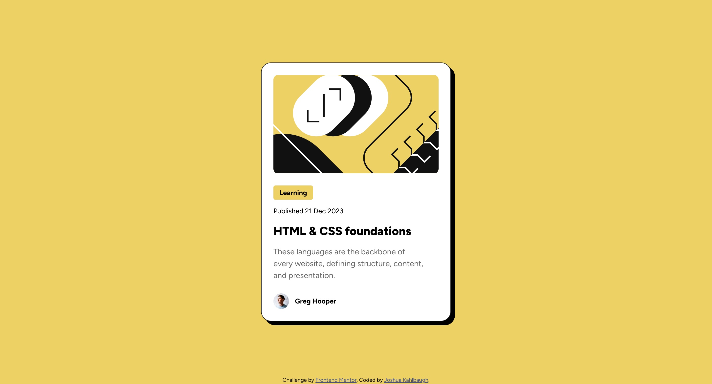

# Frontend Mentor - Blog preview card solution

This is a solution to the [Blog preview card challenge on Frontend Mentor](https://www.frontendmentor.io/challenges/blog-preview-card-ckPaj01IcS). Frontend Mentor challenges help you improve your coding skills by building realistic projects. 

## Table of contents

- [Overview](#overview)
  - [The challenge](#the-challenge)
  - [Screenshot](#screenshot)
  - [Links](#links)
- [My process](#my-process)
  - [Built with](#built-with)
  - [What I learned](#what-i-learned)
  - [Continued development](#continued-development)
  - [Useful resources](#useful-resources)
- [Author](#author)
- [Acknowledgments](#acknowledgments)

**Note: Delete this note and update the table of contents based on what sections you keep.**

## Overview

### The challenge

Users should be able to:

- See hover and focus states for all interactive elements on the page

### Screenshot



### Links

- Solution URL: [Solution](https://github.com/Joshk7/blog-preview-card)
- Live Site URL: [Live Site](https://blog-preview-card-virid-phi.vercel.app/)

## My process

I learned from the last challenge that I can start a project with a css reset file. From their styling was simple
because I just relied on Figma to show me exactly how many pixels to specify for width height and padding.
I also learned a little bit about cursor states and how to use conditional css from the challenge.

### Built with

- Semantic HTML5 markup
- CSS custom properties
- Flexbox

### What I learned

One small item that I learned was how to make extra bold font by specifying a font weight value with a number. Particularly,
extra bold text has a font weight of 800. Additionally, working with box-sizing: border-box is so much easier.

```css
.title {
    font-size: 1.5rem;
    line-height: 1.5;
    font-weight: 800;
    letter-spacing: 0;
}
```

As part of this challenge I also added a hover state to the main title "HTML & CSS Foundations".

```css
.title:hover {
    color: var(--yellow);
    cursor: pointer;
}
```

The html was similar to the qr-code-component challenge so I didn't change that much.

### Continued development

I'd like to add a couple of accessibility elements, but this solution works pretty well on its own.

### Useful resources

- [Josh Comeau CSS Reset](https://www.joshwcomeau.com/css/custom-css-reset/) - I read through this article to learn about what
resetting css is. It helped speed up the process for styling this solution.

## Author

- Website - [Joshua Kahlbaugh](https://joshuakahlbaugh.pages.dev/)
- Frontend Mentor - [@JoshK7](https://www.frontendmentor.io/profile/Joshk7)

## Acknowledgments

I'd like to thank @KapteynUniverse for showing me what a CSS reset is and explaining a couple of style tips from the previous
challenge.
